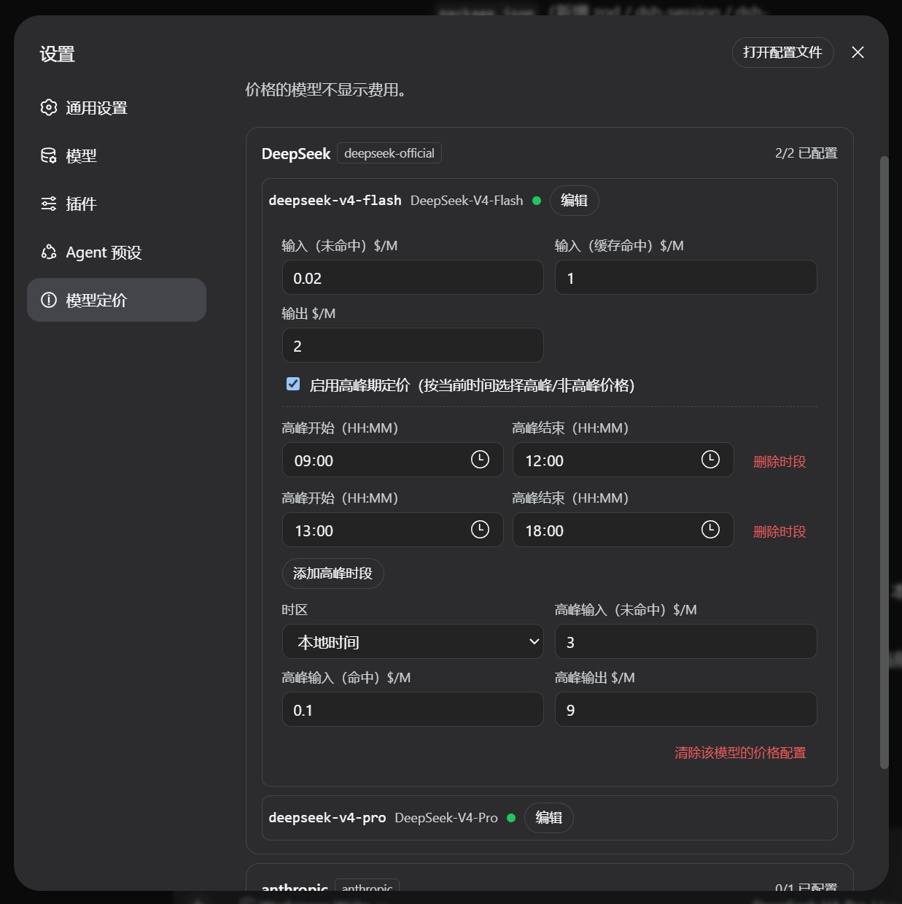
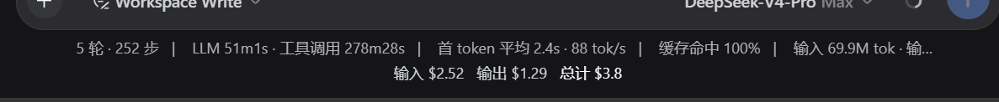
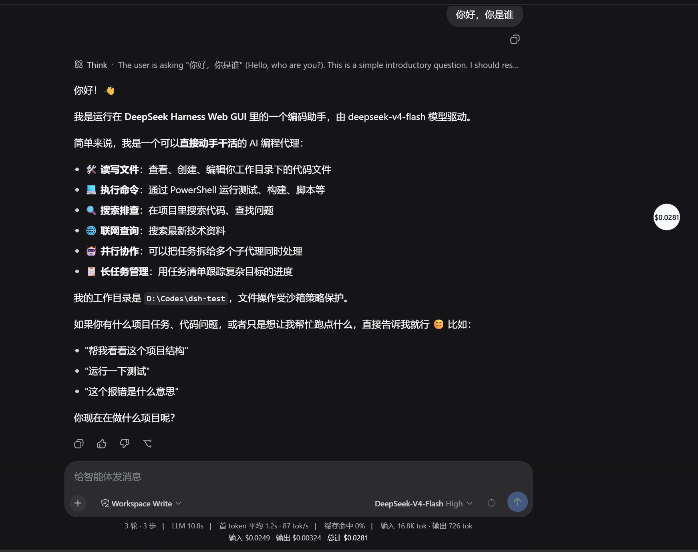
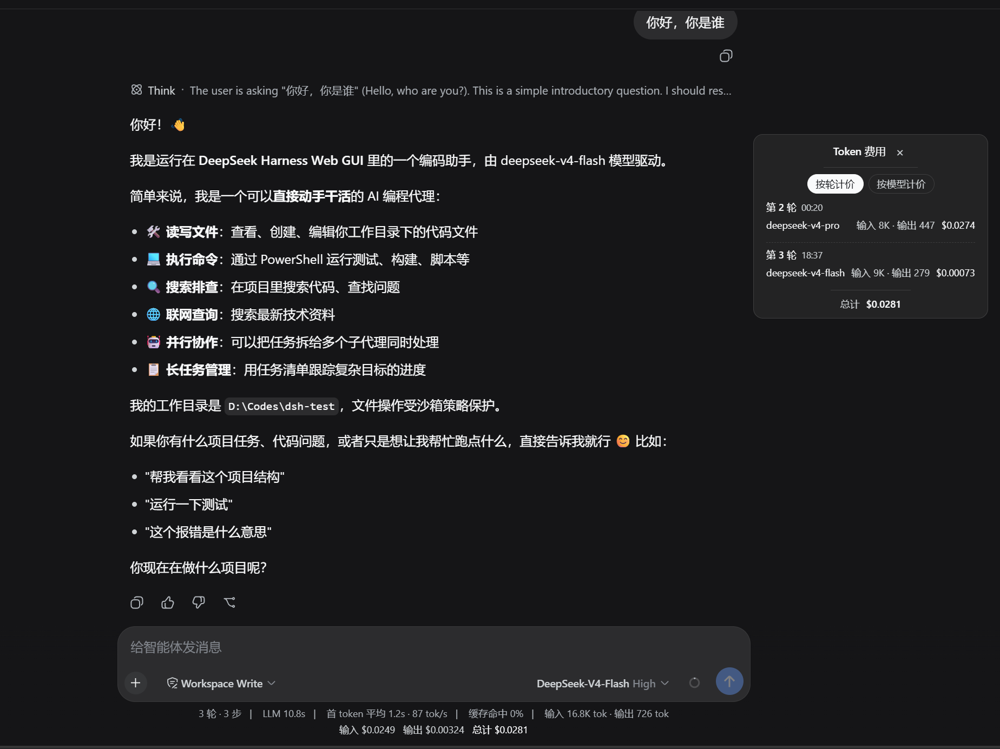
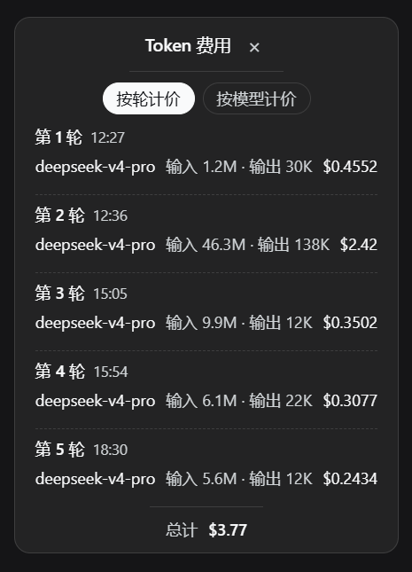
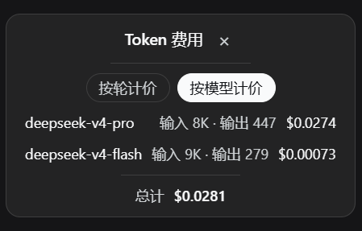

# dsh-client-token-pricing

[中文](README.md) | English

Per-provider/model token pricing for the web surface: configure USD rates per provider/model (uncached input, cache-hit input, output, plus an optional peak rate set over any number of peak windows) and watch the conversation's cost across three surfaces — the bottom data bar, and a collapsible, draggable floating window with per-turn ("按轮计价") and per-model ("按模型计价") views. Per-turn usage is derived from the session log by the `tokenPricing` projection, so it persists with the session and travels with an archived one. The node half registers the settings namespace and the projection; everything else rides existing host services.

## Features

### Configure per-model rates and peak-hour rules

设置 → 模型定价 groups the model catalog into one card per provider route, each listing its models with a configured/unconfigured dot. Expanding a model opens its editor, which loads the stored entry and lets you set the three base rates — uncached input, cache-hit input, and output, in USD per 1M tokens — plus the peak-hour pricing rules: enable peak pricing, then add or remove any number of peak windows (`添加高峰时段` / `删除时段`) that all share one peak rate set. One window exists by default, windows may wrap past midnight (22:00–08:00), and the current time inside any window selects the peak rates. 

### Live cost readout in the conversation data bar

The bottom data bar beside the shipped stats line shows the session's `输入 $X · 输出 $Y · 总计 $Z`. Every step is priced at its own time under its dispatch route, and the readout sums every priced step, so it always equals the floating window's total; usage whose route has no pricing entry is excluded from this figure.

### A floating cost window: fold, expand, drag

Folded, the window is a small cost ball showing the whole-session total; clicking it expands the panel.

Expanded, the panel shows the two view tabs and the footer total. The header (top) and the footer (bottom) are both drag zones.

### Per-turn and per-model breakdowns

The floating window offers two ways to charge: by the number of conversation turns or by the model.

`按轮计价` lists one row per conversation turn — turn number and start time — with each route used in that turn showing its token counts and cost. A mid-turn model switch splits the turn into one row per route.

`按模型计价` aggregates token counts and cost per model across every turn of the session, in first-use order. In both views, a route whose model has no pricing rule still shows its token counts with the `未设置计价` hint.

## How the figures are derived

Per-turn usage is not stored separately: the `tokenPricing` projection folds the session's durable event log into per-step usage facts — each `assistant/message` with provider-reported `usage`, stamped with the dispatch route from the latest `request/header` and the step's own time. Because the fold replays the log, the data persists with the session, survives restart, and travels with an archived session (archiving only hides the row, it never rewrites the log). The projection carries usage facts only — rates live in the settings scope — so the browser prices every step at render time and a retroactive entry edit reprises history. Peak/off-peak is decided per step from the step's own time: a step falls under the peak rate set while any of its entry's `peakWindows` contains that moment.

The `/client` exports are the plugin body (`apply`/`inject`), the dock, float, and section components, and their injected face types. Pure cost math lives in `src/client/pricing.ts`; the projection fold lives in `src/projection.ts`.

## Model Experience

### Cost readouts over logged usage

#### What the model sees

The plugin adds nothing to any model request: it registers no tools and no prompt sections, and no settings value enters the request path. The dock, the floating window, and the settings page only present durable data already on the wire — the `tokenPricing` projection values and the `token-pricing` settings section.

#### Token effect

Zero: no prompt content, tool schema, or message is added, removed, or altered by this package.

#### KV Cache effect

None: request composition, cache reuse, and compaction are untouched; the `tokenPricing` fold only runs after requests commit.

## Known Limitations and Deferred Work

- **Compaction summaries are unbilled** — the compaction step's own model call appends no usage event, so its cost is absent from every figure (the same coverage as the `tokenUsage` meter).
- **Steps without provider usage are unbilled** — an adapter that reports no accounting, or a step aborted before its message assembled, contributes no row.
- **The floating window's position is per-load** — its drag position lives in component state and resets on a page reload.
- **The dock figure covers configured routes only** — usage whose route has no pricing entry contributes nothing to the dock total; the floating window's per-model view is where that usage is shown as unpriced.
